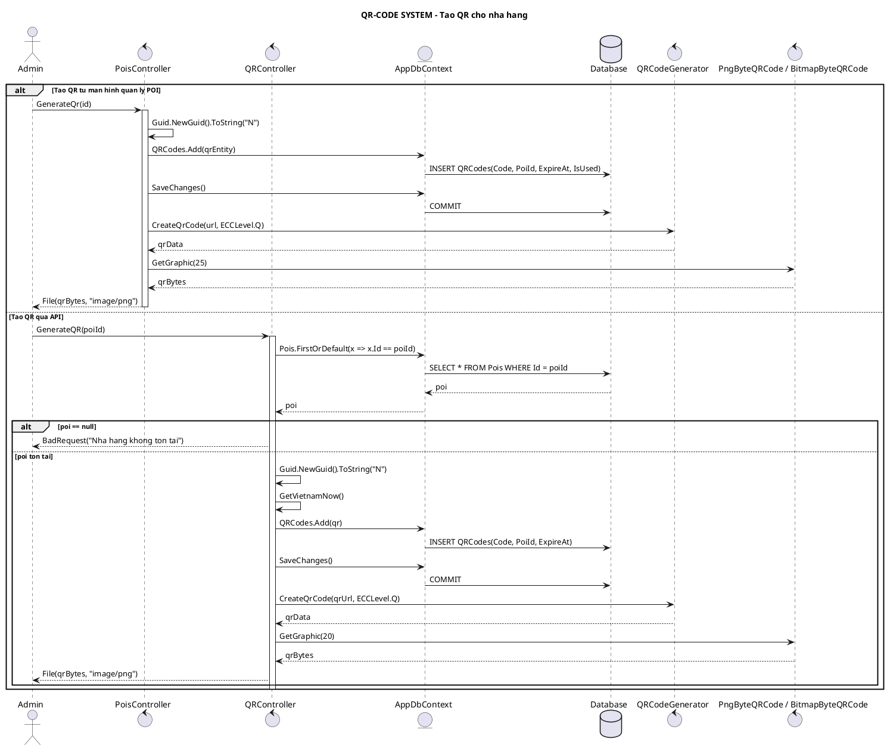
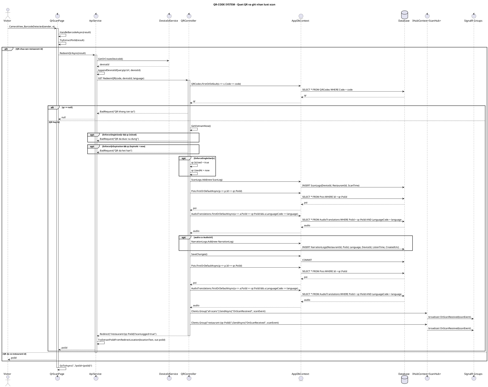
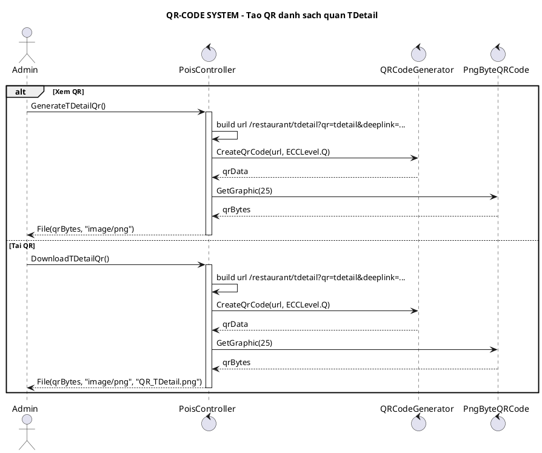

# QR-CODE SYSTEM - Sequence Diagram

## 1. Tao QR cho nha hang

```plantuml
@startuml
title QR-CODE SYSTEM - Tao QR cho nha hang

actor Admin
control "PoisController" as PoisController
control "QRController" as QRController
entity "AppDbContext" as DbContext
database "Database" as Database
control "QRCodeGenerator" as QRCodeGenerator
control "PngByteQRCode / BitmapByteQRCode" as QRImage

alt Tao QR tu man hinh quan ly POI
    Admin -> PoisController: GenerateQr(id)
    activate PoisController
    PoisController -> PoisController: Guid.NewGuid().ToString("N")
    PoisController -> DbContext: QRCodes.Add(qrEntity)
    DbContext -> Database: INSERT QRCodes(Code, PoiId, ExpireAt, IsUsed)
    PoisController -> DbContext: SaveChanges()
    DbContext -> Database: COMMIT
    PoisController -> QRCodeGenerator: CreateQrCode(url, ECCLevel.Q)
    QRCodeGenerator --> PoisController: qrData
    PoisController -> QRImage: GetGraphic(25)
    QRImage --> PoisController: qrBytes
    PoisController --> Admin: File(qrBytes, "image/png")
    deactivate PoisController
else Tao QR qua API
    Admin -> QRController: GenerateQR(poiId)
    activate QRController
    QRController -> DbContext: Pois.FirstOrDefault(x => x.Id == poiId)
    DbContext -> Database: SELECT * FROM Pois WHERE Id = poiId
    Database --> DbContext: poi
    DbContext --> QRController: poi

    alt poi == null
        QRController --> Admin: BadRequest("Nha hang khong ton tai")
    else poi ton tai
        QRController -> QRController: Guid.NewGuid().ToString("N")
        QRController -> QRController: GetVietnamNow()
        QRController -> DbContext: QRCodes.Add(qr)
        DbContext -> Database: INSERT QRCodes(Code, PoiId, ExpireAt)
        QRController -> DbContext: SaveChanges()
        DbContext -> Database: COMMIT
        QRController -> QRCodeGenerator: CreateQrCode(qrUrl, ECCLevel.Q)
        QRCodeGenerator --> QRController: qrData
        QRController -> QRImage: GetGraphic(20)
        QRImage --> QRController: qrBytes
        QRController --> Admin: File(qrBytes, "image/png")
    end
    deactivate QRController
end

@enduml
```

## 2. Quet QR va ghi nhan luot scan

```plantuml
@startuml
title QR-CODE SYSTEM - Quet QR va ghi nhan luot scan

actor Visitor
control "QrScanPage" as QrScanPage
control "ApiService" as ApiService
control "DeviceIdService" as DeviceIdService
control "QRController" as QRController
entity "AppDbContext" as DbContext
database "Database" as Database
control "IHubContext<ScanHub>" as HubContext
control "SignalR Groups" as SignalR

Visitor -> QrScanPage: CameraView_BarcodeDetected(sender, e)
activate QrScanPage
QrScanPage -> QrScanPage: HandleBarcodeAsync(result)
QrScanPage -> QrScanPage: TryExtractPoiId(result)

alt QR chua san restaurant id
    QrScanPage -> ApiService: RedeemQrAsync(result)
    activate ApiService
    ApiService -> DeviceIdService: GetOrCreateDeviceId()
    DeviceIdService --> ApiService: deviceId
    ApiService -> ApiService: AppendDeviceIdQuery(qrUrl, deviceId)
    ApiService -> QRController: GET RedeemQR(code, deviceId, language)
    activate QRController

    QRController -> DbContext: QRCodes.FirstOrDefault(x => x.Code == code)
    DbContext -> Database: SELECT * FROM QRCodes WHERE Code = code
    Database --> DbContext: qr
    DbContext --> QRController: qr

    alt qr == null
        QRController --> ApiService: BadRequest("QR khong ton tai")
        ApiService --> QrScanPage: null
    else QR hop le
        QRController -> QRController: GetVietnamNow()

        opt EnforceSingleUseQr && qr.IsUsed
            QRController --> ApiService: BadRequest("QR da duoc su dung")
        end

        opt EnforceQrExpiration && qr.ExpireAt < now
            QRController --> ApiService: BadRequest("QR da het han")
        end

        opt EnforceSingleUseQr
            QRController -> QRController: qr.IsUsed = true
            QRController -> QRController: qr.UsedAt = now
        end

        QRController -> DbContext: ScanLogs.Add(new ScanLog)
        DbContext -> Database: INSERT ScanLogs(DeviceId, RestaurantId, ScanTime)

        QRController -> DbContext: Pois.FirstOrDefaultAsync(p => p.Id == qr.PoiId)
        DbContext -> Database: SELECT * FROM Pois WHERE Id = qr.PoiId
        Database --> DbContext: poi
        DbContext --> QRController: poi

        QRController -> DbContext: AudioTranslations.FirstOrDefaultAsync(a => a.PoiId == qr.PoiId && a.LanguageCode == language)
        DbContext -> Database: SELECT * FROM AudioTranslations WHERE PoiId = qr.PoiId AND LanguageCode = language
        Database --> DbContext: audio
        DbContext --> QRController: audio

        opt audio co AudioUrl
            QRController -> DbContext: NarrationLogs.Add(new NarrationLog)
            DbContext -> Database: INSERT NarrationLogs(RestaurantId, PoiId, Language, DeviceId, ListenTime, CreatedUtc)
        end

        QRController -> DbContext: SaveChanges()
        DbContext -> Database: COMMIT

        QRController -> DbContext: Pois.FirstOrDefaultAsync(p => p.Id == qr.PoiId)
        DbContext -> Database: SELECT * FROM Pois WHERE Id = qr.PoiId
        Database --> DbContext: poi
        DbContext --> QRController: poi

        QRController -> DbContext: AudioTranslations.FirstOrDefaultAsync(a => a.PoiId == qr.PoiId && a.LanguageCode == language)
        DbContext -> Database: SELECT * FROM AudioTranslations WHERE PoiId = qr.PoiId AND LanguageCode = language
        Database --> DbContext: audio
        DbContext --> QRController: audio

        QRController -> HubContext: Clients.Group("all-scans").SendAsync("OnScanReceived", scanEvent)
        HubContext -> SignalR: broadcast OnScanReceived(scanEvent)
        QRController -> HubContext: Clients.Group("restaurant-{qr.PoiId}").SendAsync("OnScanReceived", scanEvent)
        HubContext -> SignalR: broadcast OnScanReceived(scanEvent)

        QRController --> ApiService: Redirect("/restaurant/{qr.PoiId}?scanLogged=true")
        deactivate QRController

        ApiService -> ApiService: TryExtractPoiIdFromRedirectLocation(locationText, out poiId)
        ApiService --> QrScanPage: poiId
    end
    deactivate ApiService
else QR da co restaurant id
    QrScanPage --> Visitor: poiId
end

QrScanPage -> QrScanPage: GoToAsync("..?poiId={poiId}")
deactivate QrScanPage

@enduml
```

## 3. QR danh sach quan TDetail

```plantuml
@startuml
title QR-CODE SYSTEM - Tao QR danh sach quan TDetail

actor Admin
control "PoisController" as PoisController
control "QRCodeGenerator" as QRCodeGenerator
control "PngByteQRCode" as QRImage

alt Xem QR
    Admin -> PoisController: GenerateTDetailQr()
    activate PoisController
    PoisController -> PoisController: build url /restaurant/tdetail?qr=tdetail&deeplink=...
    PoisController -> QRCodeGenerator: CreateQrCode(url, ECCLevel.Q)
    QRCodeGenerator --> PoisController: qrData
    PoisController -> QRImage: GetGraphic(25)
    QRImage --> PoisController: qrBytes
    PoisController --> Admin: File(qrBytes, "image/png")
    deactivate PoisController
else Tai QR
    Admin -> PoisController: DownloadTDetailQr()
    activate PoisController
    PoisController -> PoisController: build url /restaurant/tdetail?qr=tdetail&deeplink=...
    PoisController -> QRCodeGenerator: CreateQrCode(url, ECCLevel.Q)
    QRCodeGenerator --> PoisController: qrData
    PoisController -> QRImage: GetGraphic(25)
    QRImage --> PoisController: qrBytes
    PoisController --> Admin: File(qrBytes, "image/png", "QR_TDetail.png")
    deactivate PoisController
end

@enduml
```
