# CHUONG 13: WEB ADMIN DASHBOARD

## 13.1 Tong quan

Web Admin Dashboard cung cap goc nhin tong the ve hoat dong cua he thong FoodStreet, bao gom:

- Luu luong nguoi dung Web va Mobile App
- Hanh vi quet QR theo quan, theo gio va theo ngay
- Trang thai ket noi thiet bi
- Lich su connect / disconnect
- Thong ke nghe thuyet minh
- So sanh du lieu theo thoi gian

Dashboard lay du lieu thong qua cac API backend va cap nhat theo hai co che:

- Gan thoi gian thuc: polling dinh ky tu cac ham `refreshAll()`, `refreshOnlineCountersOnly()`, `loadTrafficOverview()`.
- Thoi gian thuc: SignalR `ScanHub` lang nghe su kien `OnScanReceived`.

## 13.2 Cac thanh phan chinh

### 13.2.1 Thong ke tong quan

Hien thi cac chi so quan trong:

- So nguoi online
- Tong luot quet QR
- Tong luot nghe thuyet minh

Nguon du lieu:

- `/api/DevicePresence/online-devices`
- `/api/Online/web-detail-count`
- `/api/ScanAnalytics/overview`
- `/api/ScanAnalytics/narration-stats`

Ham xu ly chinh:

- `loadOnlineUsers()`
- `loadOverview()`
- `loadNarrationStats()`
- `DevicePresenceController.GetOnlineDevices()`
- `OnlineController.GetWebDetailOnlineCount()`
- `ScanAnalyticsController.GetOverview()`
- `ScanAnalyticsController.GetNarrationStats()`

Y nghia: giup admin nam nhanh tinh hinh he thong tai thoi diem hien tai.

### 13.2.2 Top quan

Hien thi danh sach quan co luot quet cao nhat.

Du lieu tra ve:

```json
{
  "restaurantId": 1,
  "restaurantName": "Ten quan",
  "count": 10
}
```

Nguon du lieu:

- `/api/ScanAnalytics/overview`

Ham xu ly chinh:

- `loadOverview()`
- `ScanAnalyticsController.GetOverview()`
- `BuildFilteredQuery(restaurantId, fromUtc, toUtc)`

Y nghia: danh gia muc do quan tam cua khach voi tung quan va ho tro quyet dinh kinh doanh.

### 13.2.3 Phan tich luu luong Web va App

Dashboard so sanh traffic giua Web va Mobile App.

Chi so hien thi:

- Web active users
- Web connect / disconnect
- App connect / disconnect
- Unique devices
- Timeline theo ngay

Nguon du lieu:

- `/api/ScanAnalytics/traffic-overview`

Ham xu ly chinh:

- `loadTrafficOverview()`
- `ScanAnalyticsController.GetTrafficOverview()`
- `OnlineUsersService.GetRestaurantDetailOnlineCountAsync(restaurantId)`

Y nghia:

- Biet nen tang nao dang co luu luong cao hon
- Theo doi tang truong nguoi dung theo ngay
- Phat hien bat thuong trong hanh vi ket noi

### 13.2.4 Bieu do luot quet theo gio

Hien thi bang bar chart.

- Truc X: gio tu 0 den 23
- Truc Y: so luot quet
- Du lieu: `{ hour, count }`

Nguon du lieu:

- `/api/ScanAnalytics/patterns`

Ham xu ly chinh:

- `loadPatterns()`
- `ScanAnalyticsController.GetPatterns()`

Y nghia: xac dinh gio cao diem trong ngay va toi uu chien dich marketing theo khung gio.

### 13.2.5 Bieu do luot quet theo ngay

Hien thi bang line chart.

- Truc X: ngay
- Truc Y: so luot quet
- Du lieu: `{ date, count }`

Nguon du lieu:

- `/api/ScanAnalytics/patterns`

Ham xu ly chinh:

- `loadPatterns()`
- `ScanAnalyticsController.GetPatterns()`

Y nghia: theo doi xu huong theo thoi gian va phat hien tang/giam bat thuong.

### 13.2.6 So sanh giua hai ngay

So sanh luot quet theo gio giua ngay A va ngay B.

Hien thi:

- Hai line tren cung mot chart
- Moi line gom 24 diem du lieu theo gio

Nguon du lieu:

- `/api/ScanAnalytics/compare-days`

Ham xu ly chinh:

- `compareDays()`
- `ScanAnalyticsController.CompareDays()`

Y nghia: so sanh hieu suat giua hai ngay, vi du hom nay voi hom qua.

### 13.2.7 Lich su Connect / Disconnect

Hien thi log ket noi thiet bi.

Cot du lieu:

- Thoi gian
- DeviceId
- Source: Web hoac App
- Trang thai: Connect hoac Disconnect

Ho tro:

- Loc theo thiet bi
- Loc theo source
- Loc theo khoang thoi gian
- Phan trang

Nguon du lieu:

- `/api/DevicePresence/history`
- `/api/DevicePresence/history-devices`

Ham xu ly chinh:

- `loadDeviceHistory()`
- `loadDeviceHistoryDeviceOptions()`
- `DevicePresenceController.GetConnectionHistory()`
- `DevicePresenceController.GetHistoryDevices()`

Y nghia:

- Debug he thong realtime
- Theo doi hanh vi nguoi dung
- Phat hien bat thuong ve ket noi

## 13.3 Sequence Diagram

### 13.3.0 Sequence tong quat ngan gon nhat

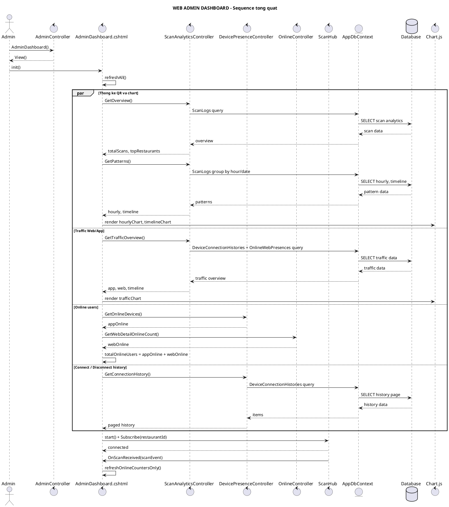
```plantuml
@startuml
title WEB ADMIN DASHBOARD - Sequence tong quat

actor Admin
control "AdminController" as AdminController
control "AdminDashboard.cshtml" as Dashboard
control "ScanAnalyticsController" as ScanAnalyticsController
control "DevicePresenceController" as DevicePresenceController
control "OnlineController" as OnlineController
control "ScanHub" as ScanHub
entity "AppDbContext" as DbContext
database "Database" as Database
control "Chart.js" as ChartJs

Admin -> AdminController: AdminDashboard()
AdminController --> Admin: View()

Admin -> Dashboard: init()
Dashboard -> Dashboard: refreshAll()

par Thong ke QR va chart
    Dashboard -> ScanAnalyticsController: GetOverview()
    ScanAnalyticsController -> DbContext: ScanLogs query
    DbContext -> Database: SELECT scan analytics
    Database --> DbContext: scan data
    DbContext --> ScanAnalyticsController: overview
    ScanAnalyticsController --> Dashboard: totalScans, topRestaurants

    Dashboard -> ScanAnalyticsController: GetPatterns()
    ScanAnalyticsController -> DbContext: ScanLogs group by hour/date
    DbContext -> Database: SELECT hourly, timeline
    Database --> DbContext: pattern data
    DbContext --> ScanAnalyticsController: patterns
    ScanAnalyticsController --> Dashboard: hourly, timeline
    Dashboard -> ChartJs: render hourlyChart, timelineChart

else Traffic Web/App
    Dashboard -> ScanAnalyticsController: GetTrafficOverview()
    ScanAnalyticsController -> DbContext: DeviceConnectionHistories + OnlineWebPresences query
    DbContext -> Database: SELECT traffic data
    Database --> DbContext: traffic data
    DbContext --> ScanAnalyticsController: traffic overview
    ScanAnalyticsController --> Dashboard: app, web, timeline
    Dashboard -> ChartJs: render trafficChart

else Online users
    Dashboard -> DevicePresenceController: GetOnlineDevices()
    DevicePresenceController --> Dashboard: appOnline
    Dashboard -> OnlineController: GetWebDetailOnlineCount()
    OnlineController --> Dashboard: webOnline
    Dashboard -> Dashboard: totalOnlineUsers = appOnline + webOnline

else Connect / Disconnect history
    Dashboard -> DevicePresenceController: GetConnectionHistory()
    DevicePresenceController -> DbContext: DeviceConnectionHistories query
    DbContext -> Database: SELECT history page
    Database --> DbContext: history data
    DbContext --> DevicePresenceController: items
    DevicePresenceController --> Dashboard: paged history
end

Dashboard -> ScanHub: start() + Subscribe(restaurantId)
ScanHub --> Dashboard: connected

ScanHub -> Dashboard: OnScanReceived(scanEvent)
Dashboard -> Dashboard: refreshOnlineCountersOnly()

@enduml
```

### 13.3.0.1 Sequence tong luot online

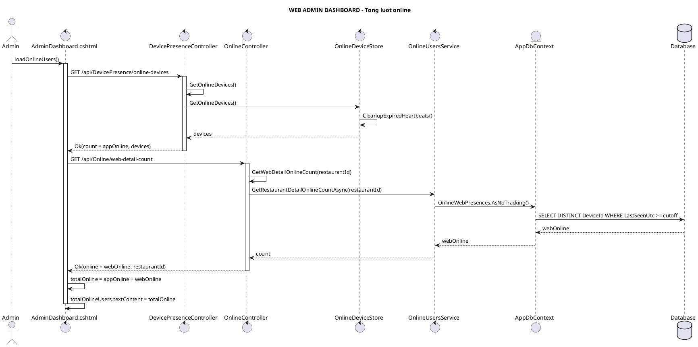
```plantuml
@startuml
title WEB ADMIN DASHBOARD - Tong luot online

actor Admin
control "AdminDashboard.cshtml" as Dashboard
control "DevicePresenceController" as DevicePresenceController
control "OnlineController" as OnlineController
control "OnlineDeviceStore" as OnlineDeviceStore
control "OnlineUsersService" as OnlineUsersService
entity "AppDbContext" as DbContext
database "Database" as Database

Admin -> Dashboard: loadOnlineUsers()
activate Dashboard

Dashboard -> DevicePresenceController: GET /api/DevicePresence/online-devices
activate DevicePresenceController
DevicePresenceController -> DevicePresenceController: GetOnlineDevices()
DevicePresenceController -> OnlineDeviceStore: GetOnlineDevices()
OnlineDeviceStore -> OnlineDeviceStore: CleanupExpiredHeartbeats()
OnlineDeviceStore --> DevicePresenceController: devices
DevicePresenceController --> Dashboard: Ok(count = appOnline, devices)
deactivate DevicePresenceController

Dashboard -> OnlineController: GET /api/Online/web-detail-count
activate OnlineController
OnlineController -> OnlineController: GetWebDetailOnlineCount(restaurantId)
OnlineController -> OnlineUsersService: GetRestaurantDetailOnlineCountAsync(restaurantId)
OnlineUsersService -> DbContext: OnlineWebPresences.AsNoTracking()
DbContext -> Database: SELECT DISTINCT DeviceId WHERE LastSeenUtc >= cutoff
Database --> DbContext: webOnline
DbContext --> OnlineUsersService: webOnline
OnlineUsersService --> OnlineController: count
OnlineController --> Dashboard: Ok(online = webOnline, restaurantId)
deactivate OnlineController

Dashboard -> Dashboard: totalOnline = appOnline + webOnline
Dashboard -> Dashboard: totalOnlineUsers.textContent = totalOnline
deactivate Dashboard

@enduml
```

### 13.3.1 Mo Admin Dashboard va tai du lieu tong quan

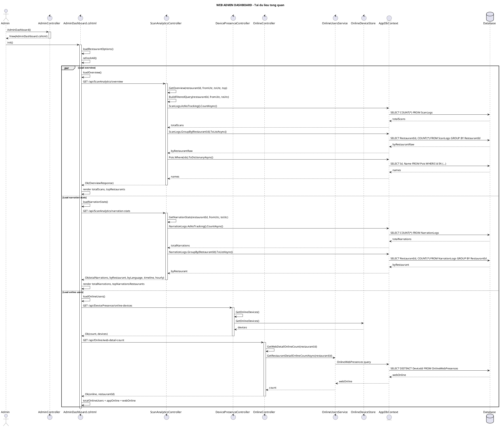
```plantuml
@startuml
title WEB ADMIN DASHBOARD - Tai du lieu tong quan

actor Admin
control "AdminController" as AdminController
control "AdminDashboard.cshtml" as Dashboard
control "ScanAnalyticsController" as ScanAnalyticsController
control "DevicePresenceController" as DevicePresenceController
control "OnlineController" as OnlineController
control "OnlineUsersService" as OnlineUsersService
control "OnlineDeviceStore" as OnlineDeviceStore
entity "AppDbContext" as DbContext
database "Database" as Database

Admin -> AdminController: AdminDashboard()
activate AdminController
AdminController --> Admin: View(AdminDashboard.cshtml)
deactivate AdminController

Admin -> Dashboard: init()
activate Dashboard
Dashboard -> Dashboard: loadRestaurantOptions()
Dashboard -> Dashboard: refreshAll()

par Load overview
    Dashboard -> Dashboard: loadOverview()
    Dashboard -> ScanAnalyticsController: GET /api/ScanAnalytics/overview
    activate ScanAnalyticsController
    ScanAnalyticsController -> ScanAnalyticsController: GetOverview(restaurantId, fromUtc, toUtc, top)
    ScanAnalyticsController -> ScanAnalyticsController: BuildFilteredQuery(restaurantId, fromUtc, toUtc)
    ScanAnalyticsController -> DbContext: ScanLogs.AsNoTracking().CountAsync()
    DbContext -> Database: SELECT COUNT(*) FROM ScanLogs
    Database --> DbContext: totalScans
    DbContext --> ScanAnalyticsController: totalScans
    ScanAnalyticsController -> DbContext: ScanLogs.GroupBy(RestaurantId).ToListAsync()
    DbContext -> Database: SELECT RestaurantId, COUNT(*) FROM ScanLogs GROUP BY RestaurantId
    Database --> DbContext: byRestaurantRaw
    DbContext --> ScanAnalyticsController: byRestaurantRaw
    ScanAnalyticsController -> DbContext: Pois.Where(ids).ToDictionaryAsync()
    DbContext -> Database: SELECT Id, Name FROM Pois WHERE Id IN (...)
    Database --> DbContext: names
    DbContext --> ScanAnalyticsController: names
    ScanAnalyticsController --> Dashboard: Ok(OverviewResponse)
    deactivate ScanAnalyticsController
    Dashboard -> Dashboard: render totalScans, topRestaurants

else Load narration stats
    Dashboard -> Dashboard: loadNarrationStats()
    Dashboard -> ScanAnalyticsController: GET /api/ScanAnalytics/narration-stats
    activate ScanAnalyticsController
    ScanAnalyticsController -> ScanAnalyticsController: GetNarrationStats(restaurantId, fromUtc, toUtc)
    ScanAnalyticsController -> DbContext: NarrationLogs.AsNoTracking().CountAsync()
    DbContext -> Database: SELECT COUNT(*) FROM NarrationLogs
    Database --> DbContext: totalNarrations
    DbContext --> ScanAnalyticsController: totalNarrations
    ScanAnalyticsController -> DbContext: NarrationLogs.GroupBy(RestaurantId).ToListAsync()
    DbContext -> Database: SELECT RestaurantId, COUNT(*) FROM NarrationLogs GROUP BY RestaurantId
    Database --> DbContext: byRestaurant
    DbContext --> ScanAnalyticsController: byRestaurant
    ScanAnalyticsController --> Dashboard: Ok(totalNarrations, byRestaurant, byLanguage, timeline, hourly)
    deactivate ScanAnalyticsController
    Dashboard -> Dashboard: render totalNarrations, topNarrationsRestaurants

else Load online users
    Dashboard -> Dashboard: loadOnlineUsers()
    Dashboard -> DevicePresenceController: GET /api/DevicePresence/online-devices
    activate DevicePresenceController
    DevicePresenceController -> DevicePresenceController: GetOnlineDevices()
    DevicePresenceController -> OnlineDeviceStore: GetOnlineDevices()
    OnlineDeviceStore --> DevicePresenceController: devices
    DevicePresenceController --> Dashboard: Ok(count, devices)
    deactivate DevicePresenceController

    Dashboard -> OnlineController: GET /api/Online/web-detail-count
    activate OnlineController
    OnlineController -> OnlineController: GetWebDetailOnlineCount(restaurantId)
    OnlineController -> OnlineUsersService: GetRestaurantDetailOnlineCountAsync(restaurantId)
    OnlineUsersService -> DbContext: OnlineWebPresences query
    DbContext -> Database: SELECT DISTINCT DeviceId FROM OnlineWebPresences
    Database --> DbContext: webOnline
    DbContext --> OnlineUsersService: webOnline
    OnlineUsersService --> OnlineController: count
    OnlineController --> Dashboard: Ok(online, restaurantId)
    deactivate OnlineController
    Dashboard -> Dashboard: totalOnlineUsers = appOnline + webOnline
end

deactivate Dashboard

@enduml
```

### 13.3.2 Tai bieu do traffic Web va App

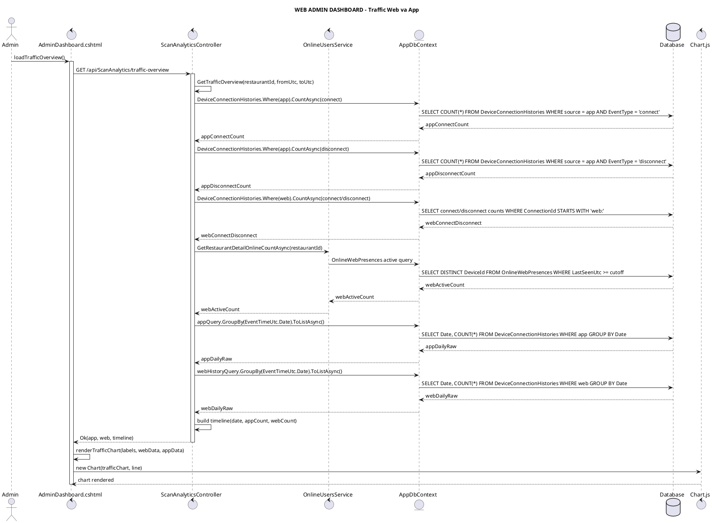
```plantuml
@startuml
title WEB ADMIN DASHBOARD - Traffic Web va App

actor Admin
control "AdminDashboard.cshtml" as Dashboard
control "ScanAnalyticsController" as ScanAnalyticsController
control "OnlineUsersService" as OnlineUsersService
entity "AppDbContext" as DbContext
database "Database" as Database
control "Chart.js" as ChartJs

Admin -> Dashboard: loadTrafficOverview()
activate Dashboard
Dashboard -> ScanAnalyticsController: GET /api/ScanAnalytics/traffic-overview
activate ScanAnalyticsController
ScanAnalyticsController -> ScanAnalyticsController: GetTrafficOverview(restaurantId, fromUtc, toUtc)

ScanAnalyticsController -> DbContext: DeviceConnectionHistories.Where(app).CountAsync(connect)
DbContext -> Database: SELECT COUNT(*) FROM DeviceConnectionHistories WHERE source = app AND EventType = 'connect'
Database --> DbContext: appConnectCount
DbContext --> ScanAnalyticsController: appConnectCount

ScanAnalyticsController -> DbContext: DeviceConnectionHistories.Where(app).CountAsync(disconnect)
DbContext -> Database: SELECT COUNT(*) FROM DeviceConnectionHistories WHERE source = app AND EventType = 'disconnect'
Database --> DbContext: appDisconnectCount
DbContext --> ScanAnalyticsController: appDisconnectCount

ScanAnalyticsController -> DbContext: DeviceConnectionHistories.Where(web).CountAsync(connect/disconnect)
DbContext -> Database: SELECT connect/disconnect counts WHERE ConnectionId STARTS WITH 'web:'
Database --> DbContext: webConnectDisconnect
DbContext --> ScanAnalyticsController: webConnectDisconnect

ScanAnalyticsController -> OnlineUsersService: GetRestaurantDetailOnlineCountAsync(restaurantId)
OnlineUsersService -> DbContext: OnlineWebPresences active query
DbContext -> Database: SELECT DISTINCT DeviceId FROM OnlineWebPresences WHERE LastSeenUtc >= cutoff
Database --> DbContext: webActiveCount
DbContext --> OnlineUsersService: webActiveCount
OnlineUsersService --> ScanAnalyticsController: webActiveCount

ScanAnalyticsController -> DbContext: appQuery.GroupBy(EventTimeUtc.Date).ToListAsync()
DbContext -> Database: SELECT Date, COUNT(*) FROM DeviceConnectionHistories WHERE app GROUP BY Date
Database --> DbContext: appDailyRaw
DbContext --> ScanAnalyticsController: appDailyRaw

ScanAnalyticsController -> DbContext: webHistoryQuery.GroupBy(EventTimeUtc.Date).ToListAsync()
DbContext -> Database: SELECT Date, COUNT(*) FROM DeviceConnectionHistories WHERE web GROUP BY Date
Database --> DbContext: webDailyRaw
DbContext --> ScanAnalyticsController: webDailyRaw

ScanAnalyticsController -> ScanAnalyticsController: build timeline(date, appCount, webCount)
ScanAnalyticsController --> Dashboard: Ok(app, web, timeline)
deactivate ScanAnalyticsController

Dashboard -> Dashboard: renderTrafficChart(labels, webData, appData)
Dashboard -> ChartJs: new Chart(trafficChart, line)
ChartJs --> Dashboard: chart rendered
deactivate Dashboard

@enduml
```

### 13.3.3 Tai bieu do luot quet theo gio va theo ngay

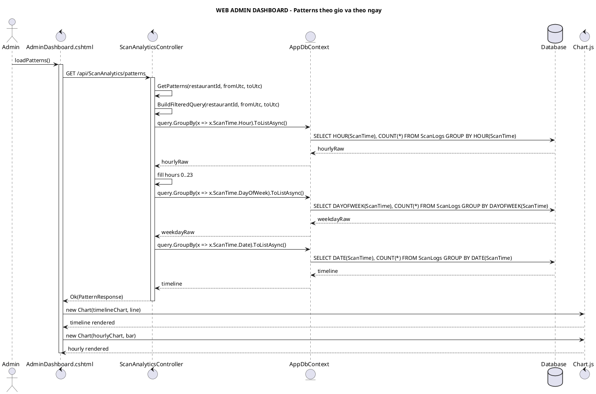
```plantuml
@startuml
title WEB ADMIN DASHBOARD - Patterns theo gio va theo ngay

actor Admin
control "AdminDashboard.cshtml" as Dashboard
control "ScanAnalyticsController" as ScanAnalyticsController
entity "AppDbContext" as DbContext
database "Database" as Database
control "Chart.js" as ChartJs

Admin -> Dashboard: loadPatterns()
activate Dashboard
Dashboard -> ScanAnalyticsController: GET /api/ScanAnalytics/patterns
activate ScanAnalyticsController
ScanAnalyticsController -> ScanAnalyticsController: GetPatterns(restaurantId, fromUtc, toUtc)
ScanAnalyticsController -> ScanAnalyticsController: BuildFilteredQuery(restaurantId, fromUtc, toUtc)

ScanAnalyticsController -> DbContext: query.GroupBy(x => x.ScanTime.Hour).ToListAsync()
DbContext -> Database: SELECT HOUR(ScanTime), COUNT(*) FROM ScanLogs GROUP BY HOUR(ScanTime)
Database --> DbContext: hourlyRaw
DbContext --> ScanAnalyticsController: hourlyRaw
ScanAnalyticsController -> ScanAnalyticsController: fill hours 0..23

ScanAnalyticsController -> DbContext: query.GroupBy(x => x.ScanTime.DayOfWeek).ToListAsync()
DbContext -> Database: SELECT DAYOFWEEK(ScanTime), COUNT(*) FROM ScanLogs GROUP BY DAYOFWEEK(ScanTime)
Database --> DbContext: weekdayRaw
DbContext --> ScanAnalyticsController: weekdayRaw

ScanAnalyticsController -> DbContext: query.GroupBy(x => x.ScanTime.Date).ToListAsync()
DbContext -> Database: SELECT DATE(ScanTime), COUNT(*) FROM ScanLogs GROUP BY DATE(ScanTime)
Database --> DbContext: timeline
DbContext --> ScanAnalyticsController: timeline

ScanAnalyticsController --> Dashboard: Ok(PatternResponse)
deactivate ScanAnalyticsController

Dashboard -> ChartJs: new Chart(timelineChart, line)
ChartJs --> Dashboard: timeline rendered
Dashboard -> ChartJs: new Chart(hourlyChart, bar)
ChartJs --> Dashboard: hourly rendered
deactivate Dashboard

@enduml
```

### 13.3.4 So sanh luot quet giua hai ngay

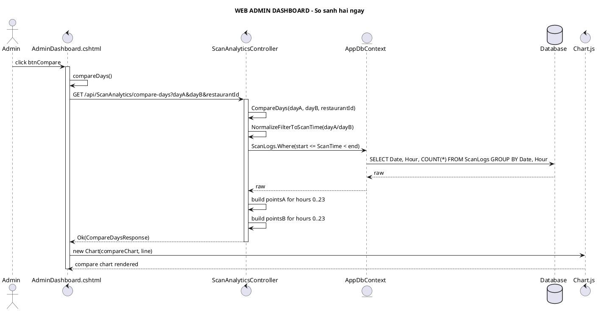
```plantuml
@startuml
title WEB ADMIN DASHBOARD - So sanh hai ngay

actor Admin
control "AdminDashboard.cshtml" as Dashboard
control "ScanAnalyticsController" as ScanAnalyticsController
entity "AppDbContext" as DbContext
database "Database" as Database
control "Chart.js" as ChartJs

Admin -> Dashboard: click btnCompare
activate Dashboard
Dashboard -> Dashboard: compareDays()
Dashboard -> ScanAnalyticsController: GET /api/ScanAnalytics/compare-days?dayA&dayB&restaurantId
activate ScanAnalyticsController
ScanAnalyticsController -> ScanAnalyticsController: CompareDays(dayA, dayB, restaurantId)
ScanAnalyticsController -> ScanAnalyticsController: NormalizeFilterToScanTime(dayA/dayB)
ScanAnalyticsController -> DbContext: ScanLogs.Where(start <= ScanTime < end)
DbContext -> Database: SELECT Date, Hour, COUNT(*) FROM ScanLogs GROUP BY Date, Hour
Database --> DbContext: raw
DbContext --> ScanAnalyticsController: raw
ScanAnalyticsController -> ScanAnalyticsController: build pointsA for hours 0..23
ScanAnalyticsController -> ScanAnalyticsController: build pointsB for hours 0..23
ScanAnalyticsController --> Dashboard: Ok(CompareDaysResponse)
deactivate ScanAnalyticsController
Dashboard -> ChartJs: new Chart(compareChart, line)
ChartJs --> Dashboard: compare chart rendered
deactivate Dashboard

@enduml
```

### 13.3.5 Tai lich su Connect / Disconnect co filter va phan trang

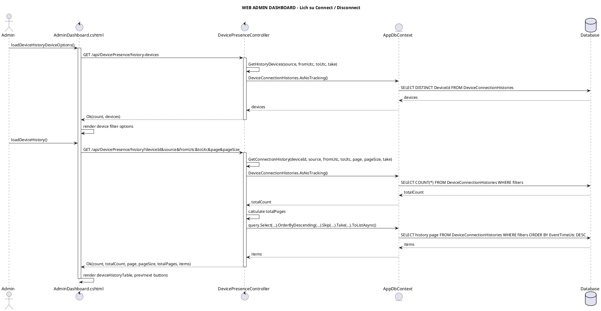
```plantuml
@startuml
title WEB ADMIN DASHBOARD - Lich su Connect / Disconnect

actor Admin
control "AdminDashboard.cshtml" as Dashboard
control "DevicePresenceController" as DevicePresenceController
entity "AppDbContext" as DbContext
database "Database" as Database

Admin -> Dashboard: loadDeviceHistoryDeviceOptions()
activate Dashboard
Dashboard -> DevicePresenceController: GET /api/DevicePresence/history-devices
activate DevicePresenceController
DevicePresenceController -> DevicePresenceController: GetHistoryDevices(source, fromUtc, toUtc, take)
DevicePresenceController -> DbContext: DeviceConnectionHistories.AsNoTracking()
DbContext -> Database: SELECT DISTINCT DeviceId FROM DeviceConnectionHistories
Database --> DbContext: devices
DbContext --> DevicePresenceController: devices
DevicePresenceController --> Dashboard: Ok(count, devices)
deactivate DevicePresenceController
Dashboard -> Dashboard: render device filter options

Admin -> Dashboard: loadDeviceHistory()
Dashboard -> DevicePresenceController: GET /api/DevicePresence/history?deviceId&source&fromUtc&toUtc&page&pageSize
activate DevicePresenceController
DevicePresenceController -> DevicePresenceController: GetConnectionHistory(deviceId, source, fromUtc, toUtc, page, pageSize, take)
DevicePresenceController -> DbContext: DeviceConnectionHistories.AsNoTracking()
DbContext -> Database: SELECT COUNT(*) FROM DeviceConnectionHistories WHERE filters
Database --> DbContext: totalCount
DbContext --> DevicePresenceController: totalCount
DevicePresenceController -> DevicePresenceController: calculate totalPages
DevicePresenceController -> DbContext: query.Select(...).OrderByDescending(...).Skip(...).Take(...).ToListAsync()
DbContext -> Database: SELECT history page FROM DeviceConnectionHistories WHERE filters ORDER BY EventTimeUtc DESC
Database --> DbContext: items
DbContext --> DevicePresenceController: items
DevicePresenceController --> Dashboard: Ok(count, totalCount, page, pageSize, totalPages, items)
deactivate DevicePresenceController
Dashboard -> Dashboard: render deviceHistoryTable, prev/next buttons
deactivate Dashboard

@enduml
```

### 13.3.6 Cap nhat realtime khi co QR scan

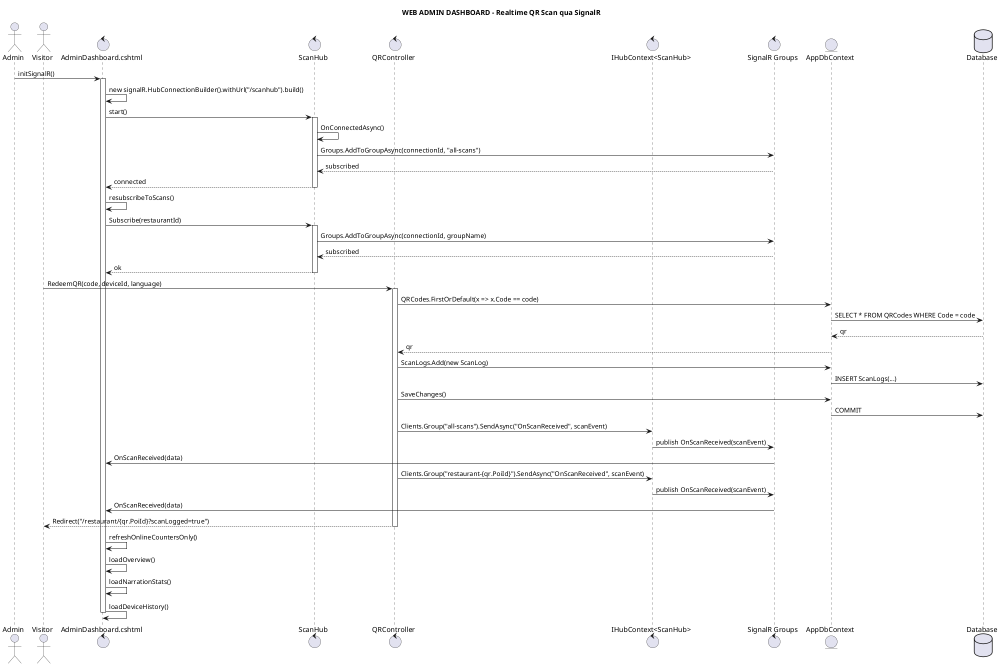
```plantuml
@startuml
title WEB ADMIN DASHBOARD - Realtime QR Scan qua SignalR

actor Admin
actor Visitor
control "AdminDashboard.cshtml" as Dashboard
control "ScanHub" as ScanHub
control "QRController" as QRController
control "IHubContext<ScanHub>" as HubContext
control "SignalR Groups" as SignalR
entity "AppDbContext" as DbContext
database "Database" as Database

Admin -> Dashboard: initSignalR()
activate Dashboard
Dashboard -> Dashboard: new signalR.HubConnectionBuilder().withUrl("/scanhub").build()
Dashboard -> ScanHub: start()
activate ScanHub
ScanHub -> ScanHub: OnConnectedAsync()
ScanHub -> SignalR: Groups.AddToGroupAsync(connectionId, "all-scans")
SignalR --> ScanHub: subscribed
ScanHub --> Dashboard: connected
deactivate ScanHub

Dashboard -> Dashboard: resubscribeToScans()
Dashboard -> ScanHub: Subscribe(restaurantId)
activate ScanHub
ScanHub -> SignalR: Groups.AddToGroupAsync(connectionId, groupName)
SignalR --> ScanHub: subscribed
ScanHub --> Dashboard: ok
deactivate ScanHub

Visitor -> QRController: RedeemQR(code, deviceId, language)
activate QRController
QRController -> DbContext: QRCodes.FirstOrDefault(x => x.Code == code)
DbContext -> Database: SELECT * FROM QRCodes WHERE Code = code
Database --> DbContext: qr
DbContext --> QRController: qr
QRController -> DbContext: ScanLogs.Add(new ScanLog)
DbContext -> Database: INSERT ScanLogs(...)
QRController -> DbContext: SaveChanges()
DbContext -> Database: COMMIT
QRController -> HubContext: Clients.Group("all-scans").SendAsync("OnScanReceived", scanEvent)
HubContext -> SignalR: publish OnScanReceived(scanEvent)
SignalR -> Dashboard: OnScanReceived(data)
QRController -> HubContext: Clients.Group("restaurant-{qr.PoiId}").SendAsync("OnScanReceived", scanEvent)
HubContext -> SignalR: publish OnScanReceived(scanEvent)
SignalR -> Dashboard: OnScanReceived(data)
QRController --> Visitor: Redirect("/restaurant/{qr.PoiId}?scanLogged=true")
deactivate QRController

Dashboard -> Dashboard: refreshOnlineCountersOnly()
Dashboard -> Dashboard: loadOverview()
Dashboard -> Dashboard: loadNarrationStats()
Dashboard -> Dashboard: loadDeviceHistory()
deactivate Dashboard

@enduml
```

### 13.3.7 Ghi nhan App connect / disconnect

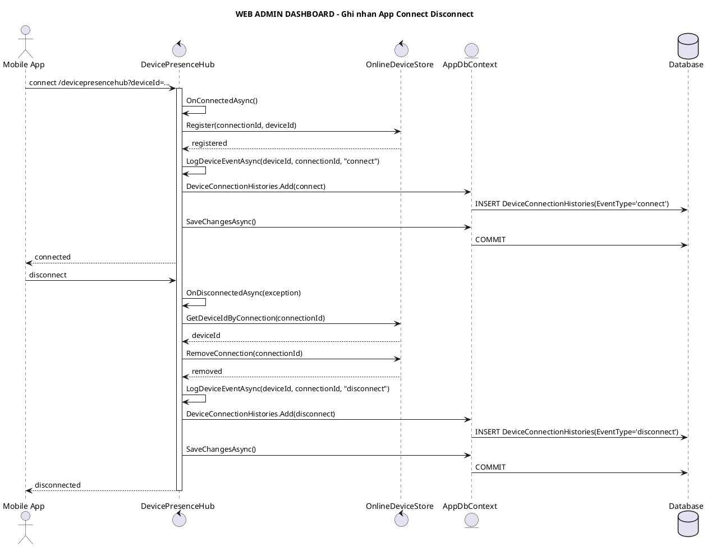
```plantuml
@startuml
title WEB ADMIN DASHBOARD - Ghi nhan App Connect Disconnect

actor "Mobile App" as MobileApp
control "DevicePresenceHub" as DevicePresenceHub
control "OnlineDeviceStore" as OnlineDeviceStore
entity "AppDbContext" as DbContext
database "Database" as Database

MobileApp -> DevicePresenceHub: connect /devicepresencehub?deviceId=...
activate DevicePresenceHub
DevicePresenceHub -> DevicePresenceHub: OnConnectedAsync()
DevicePresenceHub -> OnlineDeviceStore: Register(connectionId, deviceId)
OnlineDeviceStore --> DevicePresenceHub: registered
DevicePresenceHub -> DevicePresenceHub: LogDeviceEventAsync(deviceId, connectionId, "connect")
DevicePresenceHub -> DbContext: DeviceConnectionHistories.Add(connect)
DbContext -> Database: INSERT DeviceConnectionHistories(EventType='connect')
DevicePresenceHub -> DbContext: SaveChangesAsync()
DbContext -> Database: COMMIT
DevicePresenceHub --> MobileApp: connected

MobileApp -> DevicePresenceHub: disconnect
DevicePresenceHub -> DevicePresenceHub: OnDisconnectedAsync(exception)
DevicePresenceHub -> OnlineDeviceStore: GetDeviceIdByConnection(connectionId)
OnlineDeviceStore --> DevicePresenceHub: deviceId
DevicePresenceHub -> OnlineDeviceStore: RemoveConnection(connectionId)
OnlineDeviceStore --> DevicePresenceHub: removed
DevicePresenceHub -> DevicePresenceHub: LogDeviceEventAsync(deviceId, connectionId, "disconnect")
DevicePresenceHub -> DbContext: DeviceConnectionHistories.Add(disconnect)
DbContext -> Database: INSERT DeviceConnectionHistories(EventType='disconnect')
DevicePresenceHub -> DbContext: SaveChangesAsync()
DbContext -> Database: COMMIT
DevicePresenceHub --> MobileApp: disconnected
deactivate DevicePresenceHub

@enduml
```

### 13.3.8 Ghi nhan Web heartbeat va leave detail

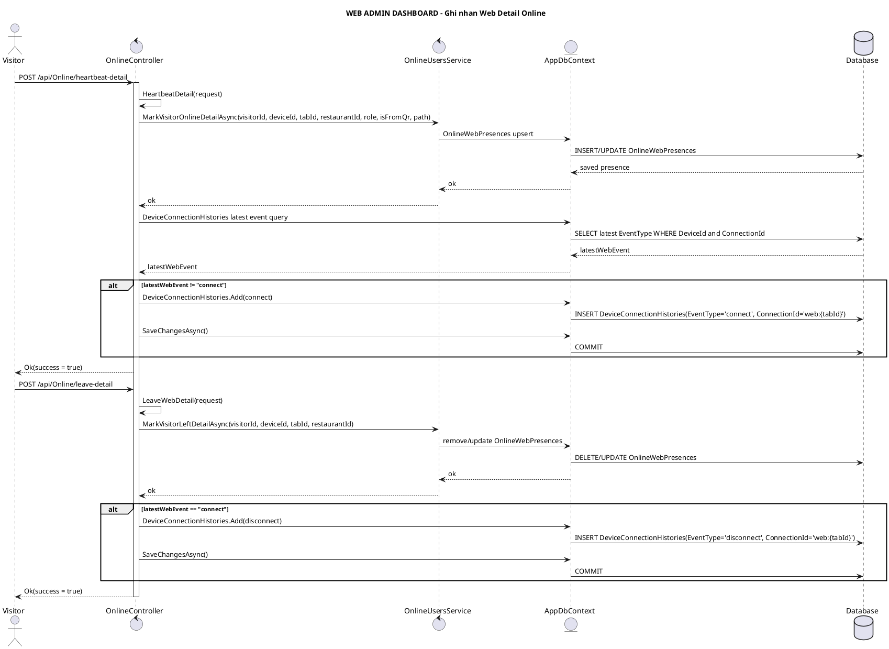
```plantuml
@startuml
title WEB ADMIN DASHBOARD - Ghi nhan Web Detail Online

actor Visitor
control "OnlineController" as OnlineController
control "OnlineUsersService" as OnlineUsersService
entity "AppDbContext" as DbContext
database "Database" as Database

Visitor -> OnlineController: POST /api/Online/heartbeat-detail
activate OnlineController
OnlineController -> OnlineController: HeartbeatDetail(request)
OnlineController -> OnlineUsersService: MarkVisitorOnlineDetailAsync(visitorId, deviceId, tabId, restaurantId, role, isFromQr, path)
OnlineUsersService -> DbContext: OnlineWebPresences upsert
DbContext -> Database: INSERT/UPDATE OnlineWebPresences
Database --> DbContext: saved presence
DbContext --> OnlineUsersService: ok
OnlineUsersService --> OnlineController: ok

OnlineController -> DbContext: DeviceConnectionHistories latest event query
DbContext -> Database: SELECT latest EventType WHERE DeviceId and ConnectionId
Database --> DbContext: latestWebEvent
DbContext --> OnlineController: latestWebEvent

alt latestWebEvent != "connect"
    OnlineController -> DbContext: DeviceConnectionHistories.Add(connect)
    DbContext -> Database: INSERT DeviceConnectionHistories(EventType='connect', ConnectionId='web:{tabId}')
    OnlineController -> DbContext: SaveChangesAsync()
    DbContext -> Database: COMMIT
end

OnlineController --> Visitor: Ok(success = true)

Visitor -> OnlineController: POST /api/Online/leave-detail
OnlineController -> OnlineController: LeaveWebDetail(request)
OnlineController -> OnlineUsersService: MarkVisitorLeftDetailAsync(visitorId, deviceId, tabId, restaurantId)
OnlineUsersService -> DbContext: remove/update OnlineWebPresences
DbContext -> Database: DELETE/UPDATE OnlineWebPresences
DbContext --> OnlineUsersService: ok
OnlineUsersService --> OnlineController: ok

alt latestWebEvent == "connect"
    OnlineController -> DbContext: DeviceConnectionHistories.Add(disconnect)
    DbContext -> Database: INSERT DeviceConnectionHistories(EventType='disconnect', ConnectionId='web:{tabId}')
    OnlineController -> DbContext: SaveChangesAsync()
    DbContext -> Database: COMMIT
end

OnlineController --> Visitor: Ok(success = true)
deactivate OnlineController

@enduml
```

# CHUONG 15: THIET BI GAN POI

## 15.1 Muc tieu

Chuc nang Thiet bi gan POI giup he thong:

- Ghi nhan thiet bi nguoi dung khi vao vung POI.
- Theo doi danh sach thiet bi dang online.
- Ho tro realtime presence qua SignalR.
- Cung cap du lieu cho dashboard/admin phan tich thiet bi gan POI va luot vao vung.

## 15.2 PRD

### 15.2.1 Pham vi chuc nang

#### a. Device Presence

- Moi thiet bi co mot `DeviceId` duy nhat.
- App tao hoac doc lai `DeviceId` bang `DeviceIdService.GetOrCreateDeviceId()`.
- App ket noi SignalR Hub:
  - `/hubs/device-presence?deviceId=...`
- Khi ket noi thanh cong, app goi:
  - `RegisterDevice(DeviceId)` tren hub.
- Server luu trang thai online vao `OnlineDeviceStore`.
- Server ghi lich su connect/disconnect vao `DeviceConnectionHistories`.

Ham xu ly chinh:

- `DevicePresenceService.DevicePresenceService()`
- `DeviceIdService.GetOrCreateDeviceId()`
- `DevicePresenceService.BuildConnection()`
- `DevicePresenceService.EnsureConnectedAsync()`
- `DevicePresenceService.RegisterDeviceAsync()`
- `DevicePresenceHub.OnConnectedAsync()`
- `DevicePresenceHub.RegisterDevice(deviceId)`
- `DevicePresenceHub.OnDisconnectedAsync(exception)`
- `DevicePresenceHub.LogDeviceEventAsync(deviceId, connectionId, eventType)`
- `OnlineDeviceStore.Register(connectionId, deviceId)`
- `OnlineDeviceStore.RemoveConnection(connectionId)`
- `OnlineDeviceStore.GetDeviceIdByConnection(connectionId)`

#### b. Online Devices API

- Backend cung cap API:
  - `GET /api/DevicePresence/online-devices`
- API tra ve danh sach thiet bi dang online va so luong thiet bi.

Ham xu ly chinh:

- `DevicePresenceController.GetOnlineDevices()`
- `OnlineDeviceStore.GetOnlineDevices()`
- `OnlineDeviceStore.CleanupExpiredHeartbeats()`

#### c. Kiem tra thiet bi co online hay khong

- Backend cung cap API:
  - `GET /api/DevicePresence/is-online/{deviceId}`
- API tra ve `online = true/false` theo `deviceId`.

Ham xu ly chinh:

- `DevicePresenceController.IsOnline(deviceId)`
- `OnlineDeviceStore.IsOnline(deviceId)`
- `OnlineDeviceStore.CleanupExpiredHeartbeats()`
- `DevicePresenceService.IsDeviceOnlineAsync(deviceId)`

#### d. Ghi nhan thiet bi di vao vung POI

- App goi API:
  - `POST /api/DevicePresence/enter-zone`
- Payload gom:
  - `DeviceId`
  - `RestaurantId`
  - `RestaurantIds`
- Backend chi ghi nhan zone khi thiet bi dang online.
- Backend chuan hoa danh sach POI bang cach gop `RestaurantId` va `RestaurantIds`, bo gia tri khong hop le va loai trung.

Ham xu ly chinh:

- `ApiService.ReportEnterPoiZoneAsync(poiId)`
- `ApiService.ReportEnterPoiZoneAsync(poiIds)`
- `DeviceIdService.GetOrCreateDeviceId()`
- `DevicePresenceController.EnterZone(request)`
- `OnlineDeviceStore.IsOnline(deviceId)`
- `OnlineDeviceStore.UpdateDeviceZone(deviceId, restaurantIds)`

#### e. Realtime status

- Khi ket noi SignalR dang reconnect:
  - app phat event `ConnectionStateChanged(false)`.
- Khi reconnect thanh cong:
  - app goi lai `RegisterDevice(DeviceId)`.
  - app phat event `ConnectionStateChanged(true)`.
- Khi connection bi close:
  - app phat event `ConnectionStateChanged(false)`.
- UI co the lang nghe event nay de cap nhat trang thai online/offline.

Ham xu ly chinh:

- `_connection.Reconnecting`
- `_connection.Reconnected`
- `_connection.Closed`
- `ConnectionStateChanged?.Invoke(true/false)`
- `MainPage.OnDeviceConnectionStateChanged(isOnline)`

#### f. Heartbeat fallback

- Backend ho tro API:
  - `POST /api/DevicePresence/heartbeat`
- API cap nhat `LastSeen` cua thiet bi khi can co co che heartbeat ngoai SignalR.
- Thiet bi heartbeat qua han se bi loai khoi danh sach online.

Ham xu ly chinh:

- `DevicePresenceController.Heartbeat(request)`
- `OnlineDeviceStore.TouchHeartbeat(deviceId)`
- `OnlineDeviceStore.CleanupExpiredHeartbeats()`

#### g. Online device zones cho dashboard

- Backend cung cap API:
  - `GET /api/DevicePresence/online-device-zones?take=...`
- API tra ve danh sach thiet bi online dang gan POI, gom ca app zone va web presence gan nhat.

Ham xu ly chinh:

- `DevicePresenceController.GetOnlineDeviceZones(take)`
- `OnlineDeviceStore.GetOnlineDevices()`
- `OnlineDeviceStore.GetDeviceZones()`
- `OnlineWebPresences.AsNoTracking()`
- `Pois.AsNoTracking()`

### 15.2.2 Luong nghiep vu chinh

#### Luong 1: App khoi dong va dang ky thiet bi

1. App khoi tao `DevicePresenceService`.
2. App tao hoac lay lai `DeviceId`.
3. App build ket noi SignalR den `/hubs/device-presence?deviceId=...`.
4. App goi `EnsureConnectedAsync()`.
5. SignalR Hub xu ly `OnConnectedAsync()`.
6. Hub dang ky connection vao `OnlineDeviceStore`.
7. Hub ghi event `connect` vao `DeviceConnectionHistories`.
8. App goi `RegisterDevice(DeviceId)` de dam bao server gan dung thiet bi.
9. App phat event `ConnectionStateChanged(true)`.

#### Luong 2: Thiet bi gan POI

1. App lay vi tri hien tai.
2. App tinh POI gan nhat hoac danh sach POI trong vung.
3. App goi `ReportEnterPoiZoneAsync(poiIds)`.
4. App tao payload `DeviceId`, `RestaurantId`, `RestaurantIds`.
5. Backend nhan `POST /api/DevicePresence/enter-zone`.
6. Backend kiem tra thiet bi co online hay khong.
7. Backend cap nhat zone cua thiet bi vao `OnlineDeviceStore`.
8. Dashboard co the doc du lieu qua `online-device-zones`.

#### Luong 3: Admin theo doi thiet bi online

1. Admin mo dashboard.
2. Dashboard goi `GET /api/DevicePresence/online-devices`.
3. Backend lay danh sach online tu `OnlineDeviceStore`.
4. Dashboard hien thi so thiet bi online va danh sach thiet bi.

#### Luong 4: Admin theo doi thiet bi gan POI

1. Admin mo dashboard hoac refresh thong ke thiet bi gan POI.
2. Dashboard goi `GET /api/DevicePresence/online-device-zones`.
3. Backend lay zone cua app tu `OnlineDeviceStore`.
4. Backend lay web presence gan nhat tu `OnlineWebPresences`.
5. Backend lay ten POI tu bang `Pois`.
6. Dashboard hien thi danh sach thiet bi, POI, source va thoi diem cap nhat.

#### Luong 5: Mat ket noi va reconnect

1. SignalR phat hien connection dang reconnect.
2. App phat `ConnectionStateChanged(false)`.
3. SignalR reconnect thanh cong.
4. App goi lai `RegisterDevice(DeviceId)`.
5. Server cap nhat lai mapping connection/device.
6. App phat `ConnectionStateChanged(true)`.
7. Neu connection dong han, hub xu ly `OnDisconnectedAsync()` va ghi event `disconnect`.

### 15.2.3 Du lieu dau vao / dau ra

Input:

- `DeviceId`
- `ConnectionId`
- `RestaurantId`
- `RestaurantIds`
- `Current Location`
- `take`

Output:

- Danh sach thiet bi online.
- Trang thai online/offline cua mot thiet bi.
- Ket qua ghi nhan `enter-zone`.
- Danh sach thiet bi dang gan POI.
- Lich su connect/disconnect.
- Du lieu thong ke cho dashboard.

### 15.2.4 Yeu cau phi chuc nang

- Realtime ket noi nhanh.
- Tu reconnect khi mat mang.
- Khong lam gian doan trai nghiem nguoi dung.
- API phai tra ve nhanh de phuc vu dashboard.
- Ho tro nhieu thiet bi dong thoi.
- Co fallback heartbeat de giam phu thuoc vao SignalR trong mot so tinh huong mang yeu.

## 15.3 Sequence Diagram

### 15.3.1 App khoi dong va dang ky thiet bi qua SignalR

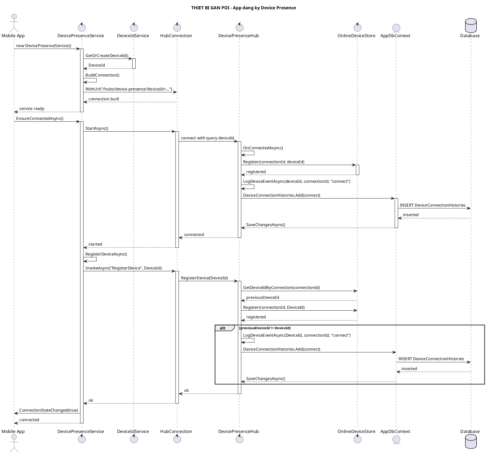
```plantuml
@startuml
title THIET BI GAN POI - App dang ky Device Presence

actor "Mobile App" as MobileApp
control "DevicePresenceService" as DevicePresenceService
control "DeviceIdService" as DeviceIdService
control "HubConnection" as HubConnection
control "DevicePresenceHub" as DevicePresenceHub
control "OnlineDeviceStore" as OnlineDeviceStore
entity "AppDbContext" as DbContext
database "Database" as Database

MobileApp -> DevicePresenceService: new DevicePresenceService()
activate DevicePresenceService
DevicePresenceService -> DeviceIdService: GetOrCreateDeviceId()
activate DeviceIdService
DeviceIdService --> DevicePresenceService: DeviceId
deactivate DeviceIdService

DevicePresenceService -> DevicePresenceService: BuildConnection()
DevicePresenceService -> HubConnection: WithUrl("/hubs/device-presence?deviceId=...")
HubConnection --> DevicePresenceService: connection built
DevicePresenceService --> MobileApp: service ready
deactivate DevicePresenceService

MobileApp -> DevicePresenceService: EnsureConnectedAsync()
activate DevicePresenceService
DevicePresenceService -> HubConnection: StartAsync()
activate HubConnection
HubConnection -> DevicePresenceHub: connect with query deviceId
activate DevicePresenceHub

DevicePresenceHub -> DevicePresenceHub: OnConnectedAsync()
DevicePresenceHub -> OnlineDeviceStore: Register(connectionId, deviceId)
activate OnlineDeviceStore
OnlineDeviceStore --> DevicePresenceHub: registered
deactivate OnlineDeviceStore

DevicePresenceHub -> DevicePresenceHub: LogDeviceEventAsync(deviceId, connectionId, "connect")
DevicePresenceHub -> DbContext: DeviceConnectionHistories.Add(connect)
activate DbContext
DbContext -> Database: INSERT DeviceConnectionHistories
Database --> DbContext: inserted
DbContext --> DevicePresenceHub: SaveChangesAsync()
deactivate DbContext

DevicePresenceHub --> HubConnection: connected
deactivate DevicePresenceHub
HubConnection --> DevicePresenceService: started
deactivate HubConnection

DevicePresenceService -> DevicePresenceService: RegisterDeviceAsync()
DevicePresenceService -> HubConnection: InvokeAsync("RegisterDevice", DeviceId)
activate HubConnection
HubConnection -> DevicePresenceHub: RegisterDevice(DeviceId)
activate DevicePresenceHub
DevicePresenceHub -> OnlineDeviceStore: GetDeviceIdByConnection(connectionId)
OnlineDeviceStore --> DevicePresenceHub: previousDeviceId
DevicePresenceHub -> OnlineDeviceStore: Register(connectionId, DeviceId)
OnlineDeviceStore --> DevicePresenceHub: registered

alt previousDeviceId != DeviceId
    DevicePresenceHub -> DevicePresenceHub: LogDeviceEventAsync(DeviceId, connectionId, "connect")
    DevicePresenceHub -> DbContext: DeviceConnectionHistories.Add(connect)
    DbContext -> Database: INSERT DeviceConnectionHistories
    Database --> DbContext: inserted
    DbContext --> DevicePresenceHub: SaveChangesAsync()
end

DevicePresenceHub --> HubConnection: ok
deactivate DevicePresenceHub
HubConnection --> DevicePresenceService: ok
deactivate HubConnection

DevicePresenceService -> MobileApp: ConnectionStateChanged(true)
DevicePresenceService --> MobileApp: connected
deactivate DevicePresenceService

@enduml
```

### 15.3.2 Mat ket noi, reconnect va close

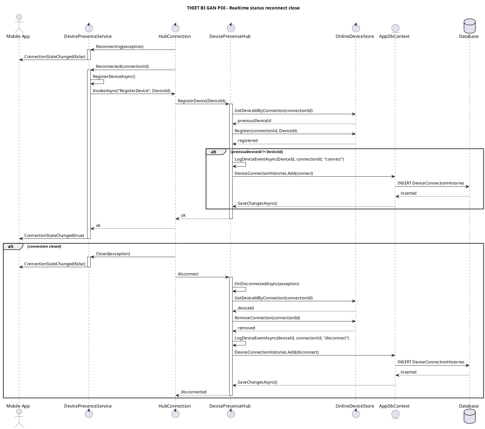
```plantuml
@startuml
title THIET BI GAN POI - Realtime status reconnect close

actor "Mobile App" as MobileApp
control "DevicePresenceService" as DevicePresenceService
control "HubConnection" as HubConnection
control "DevicePresenceHub" as DevicePresenceHub
control "OnlineDeviceStore" as OnlineDeviceStore
entity "AppDbContext" as DbContext
database "Database" as Database

HubConnection -> DevicePresenceService: Reconnecting(exception)
activate DevicePresenceService
DevicePresenceService -> MobileApp: ConnectionStateChanged(false)
deactivate DevicePresenceService

HubConnection -> DevicePresenceService: Reconnected(connectionId)
activate DevicePresenceService
DevicePresenceService -> DevicePresenceService: RegisterDeviceAsync()
DevicePresenceService -> HubConnection: InvokeAsync("RegisterDevice", DeviceId)
HubConnection -> DevicePresenceHub: RegisterDevice(DeviceId)
activate DevicePresenceHub
DevicePresenceHub -> OnlineDeviceStore: GetDeviceIdByConnection(connectionId)
OnlineDeviceStore --> DevicePresenceHub: previousDeviceId
DevicePresenceHub -> OnlineDeviceStore: Register(connectionId, DeviceId)
OnlineDeviceStore --> DevicePresenceHub: registered

alt previousDeviceId != DeviceId
    DevicePresenceHub -> DevicePresenceHub: LogDeviceEventAsync(DeviceId, connectionId, "connect")
    DevicePresenceHub -> DbContext: DeviceConnectionHistories.Add(connect)
    DbContext -> Database: INSERT DeviceConnectionHistories
    Database --> DbContext: inserted
    DbContext --> DevicePresenceHub: SaveChangesAsync()
end

DevicePresenceHub --> HubConnection: ok
deactivate DevicePresenceHub
HubConnection --> DevicePresenceService: ok
DevicePresenceService -> MobileApp: ConnectionStateChanged(true)
deactivate DevicePresenceService

alt connection closed
    HubConnection -> DevicePresenceService: Closed(exception)
    activate DevicePresenceService
    DevicePresenceService -> MobileApp: ConnectionStateChanged(false)
    deactivate DevicePresenceService

    HubConnection -> DevicePresenceHub: disconnect
    activate DevicePresenceHub
    DevicePresenceHub -> DevicePresenceHub: OnDisconnectedAsync(exception)
    DevicePresenceHub -> OnlineDeviceStore: GetDeviceIdByConnection(connectionId)
    OnlineDeviceStore --> DevicePresenceHub: deviceId
    DevicePresenceHub -> OnlineDeviceStore: RemoveConnection(connectionId)
    OnlineDeviceStore --> DevicePresenceHub: removed
    DevicePresenceHub -> DevicePresenceHub: LogDeviceEventAsync(deviceId, connectionId, "disconnect")
    DevicePresenceHub -> DbContext: DeviceConnectionHistories.Add(disconnect)
    DbContext -> Database: INSERT DeviceConnectionHistories
    Database --> DbContext: inserted
    DbContext --> DevicePresenceHub: SaveChangesAsync()
    DevicePresenceHub --> HubConnection: disconnected
    deactivate DevicePresenceHub
end

@enduml
```

### 15.3.3 API lay danh sach thiet bi online

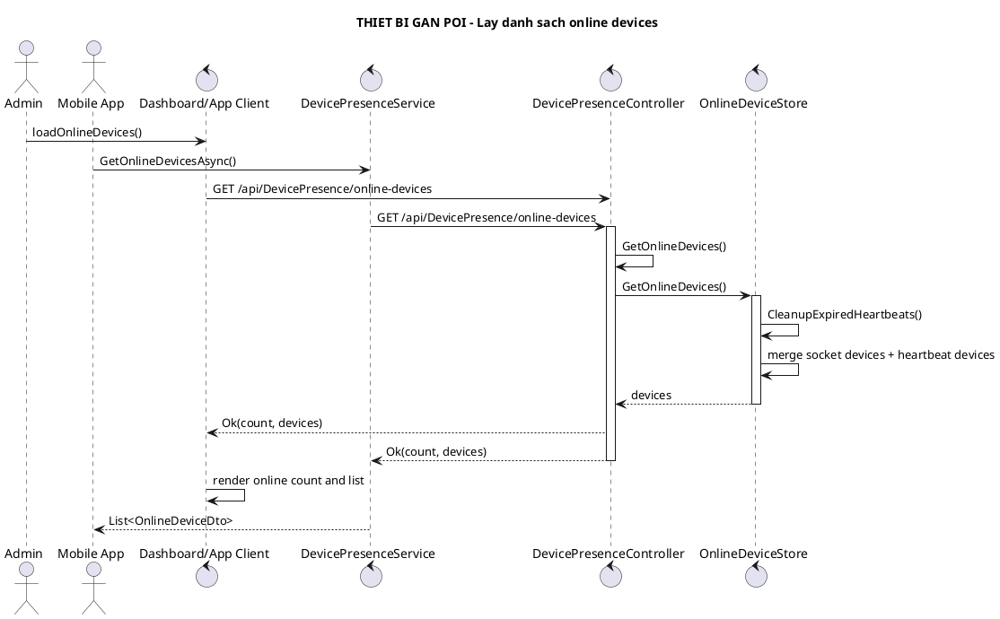
```plantuml
@startuml
title THIET BI GAN POI - Lay danh sach online devices

actor Admin
actor "Mobile App" as MobileApp
control "Dashboard/App Client" as Client
control "DevicePresenceService" as DevicePresenceService
control "DevicePresenceController" as DevicePresenceController
control "OnlineDeviceStore" as OnlineDeviceStore

Admin -> Client: loadOnlineDevices()
MobileApp -> DevicePresenceService: GetOnlineDevicesAsync()

Client -> DevicePresenceController: GET /api/DevicePresence/online-devices
DevicePresenceService -> DevicePresenceController: GET /api/DevicePresence/online-devices
activate DevicePresenceController
DevicePresenceController -> DevicePresenceController: GetOnlineDevices()
DevicePresenceController -> OnlineDeviceStore: GetOnlineDevices()
activate OnlineDeviceStore
OnlineDeviceStore -> OnlineDeviceStore: CleanupExpiredHeartbeats()
OnlineDeviceStore -> OnlineDeviceStore: merge socket devices + heartbeat devices
OnlineDeviceStore --> DevicePresenceController: devices
deactivate OnlineDeviceStore
DevicePresenceController --> Client: Ok(count, devices)
DevicePresenceController --> DevicePresenceService: Ok(count, devices)
deactivate DevicePresenceController

Client -> Client: render online count and list
DevicePresenceService --> MobileApp: List<OnlineDeviceDto>

@enduml
```

### 15.3.4 API kiem tra mot thiet bi co online hay khong

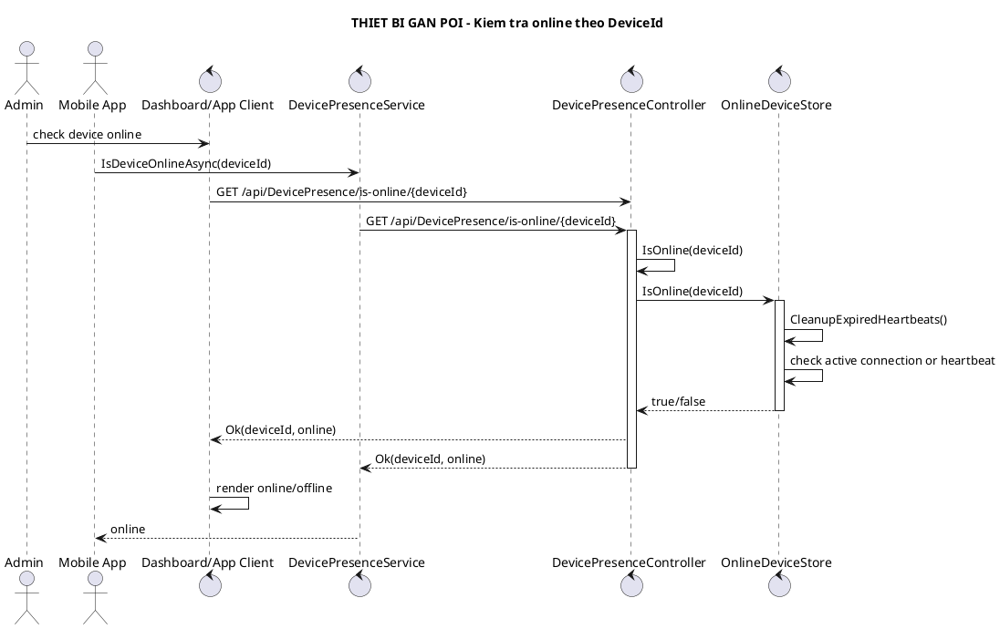
```plantuml
@startuml
title THIET BI GAN POI - Kiem tra online theo DeviceId

actor Admin
actor "Mobile App" as MobileApp
control "Dashboard/App Client" as Client
control "DevicePresenceService" as DevicePresenceService
control "DevicePresenceController" as DevicePresenceController
control "OnlineDeviceStore" as OnlineDeviceStore

Admin -> Client: check device online
MobileApp -> DevicePresenceService: IsDeviceOnlineAsync(deviceId)

Client -> DevicePresenceController: GET /api/DevicePresence/is-online/{deviceId}
DevicePresenceService -> DevicePresenceController: GET /api/DevicePresence/is-online/{deviceId}
activate DevicePresenceController
DevicePresenceController -> DevicePresenceController: IsOnline(deviceId)
DevicePresenceController -> OnlineDeviceStore: IsOnline(deviceId)
activate OnlineDeviceStore
OnlineDeviceStore -> OnlineDeviceStore: CleanupExpiredHeartbeats()
OnlineDeviceStore -> OnlineDeviceStore: check active connection or heartbeat
OnlineDeviceStore --> DevicePresenceController: true/false
deactivate OnlineDeviceStore
DevicePresenceController --> Client: Ok(deviceId, online)
DevicePresenceController --> DevicePresenceService: Ok(deviceId, online)
deactivate DevicePresenceController

Client -> Client: render online/offline
DevicePresenceService --> MobileApp: online

@enduml
```

### 15.3.5 App ghi nhan thiet bi vao vung POI

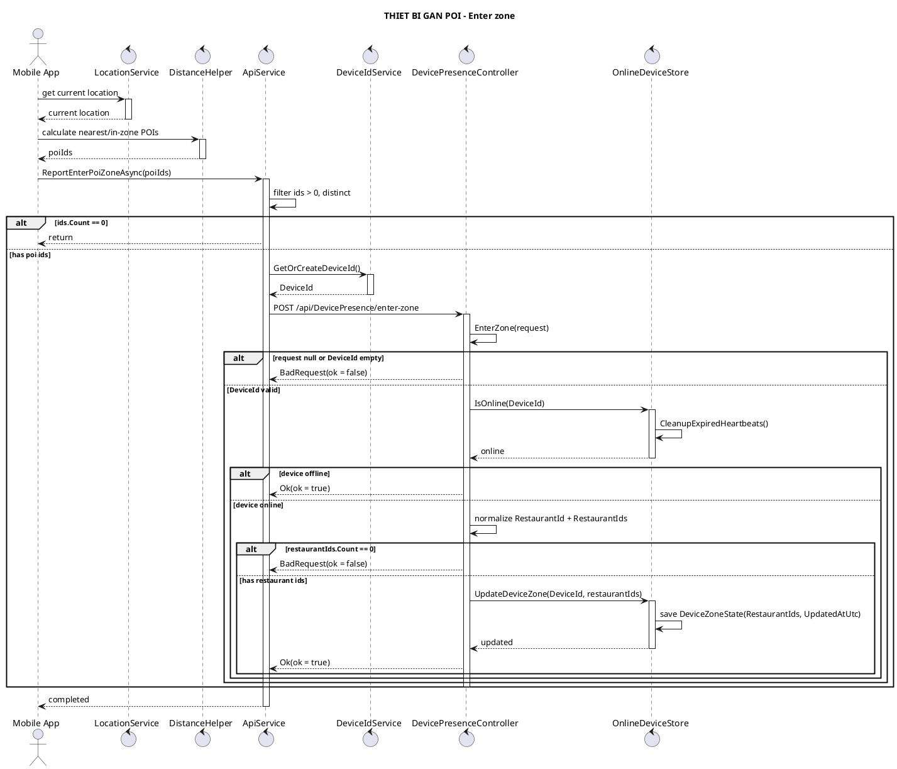
```plantuml
@startuml
title THIET BI GAN POI - Enter zone

actor "Mobile App" as MobileApp
control "LocationService" as LocationService
control "DistanceHelper" as DistanceHelper
control "ApiService" as ApiService
control "DeviceIdService" as DeviceIdService
control "DevicePresenceController" as DevicePresenceController
control "OnlineDeviceStore" as OnlineDeviceStore

MobileApp -> LocationService: get current location
activate LocationService
LocationService --> MobileApp: current location
deactivate LocationService

MobileApp -> DistanceHelper: calculate nearest/in-zone POIs
activate DistanceHelper
DistanceHelper --> MobileApp: poiIds
deactivate DistanceHelper

MobileApp -> ApiService: ReportEnterPoiZoneAsync(poiIds)
activate ApiService
ApiService -> ApiService: filter ids > 0, distinct

alt ids.Count == 0
    ApiService --> MobileApp: return
else has poi ids
    ApiService -> DeviceIdService: GetOrCreateDeviceId()
    activate DeviceIdService
    DeviceIdService --> ApiService: DeviceId
    deactivate DeviceIdService

    ApiService -> DevicePresenceController: POST /api/DevicePresence/enter-zone
    activate DevicePresenceController
    DevicePresenceController -> DevicePresenceController: EnterZone(request)

    alt request null or DeviceId empty
        DevicePresenceController --> ApiService: BadRequest(ok = false)
    else DeviceId valid
        DevicePresenceController -> OnlineDeviceStore: IsOnline(DeviceId)
        activate OnlineDeviceStore
        OnlineDeviceStore -> OnlineDeviceStore: CleanupExpiredHeartbeats()
        OnlineDeviceStore --> DevicePresenceController: online
        deactivate OnlineDeviceStore

        alt device offline
            DevicePresenceController --> ApiService: Ok(ok = true)
        else device online
            DevicePresenceController -> DevicePresenceController: normalize RestaurantId + RestaurantIds

            alt restaurantIds.Count == 0
                DevicePresenceController --> ApiService: BadRequest(ok = false)
            else has restaurant ids
                DevicePresenceController -> OnlineDeviceStore: UpdateDeviceZone(DeviceId, restaurantIds)
                activate OnlineDeviceStore
                OnlineDeviceStore -> OnlineDeviceStore: save DeviceZoneState(RestaurantIds, UpdatedAtUtc)
                OnlineDeviceStore --> DevicePresenceController: updated
                deactivate OnlineDeviceStore
                DevicePresenceController --> ApiService: Ok(ok = true)
            end
        end
    end
    deactivate DevicePresenceController
end

ApiService --> MobileApp: completed
deactivate ApiService

@enduml
```

### 15.3.6 Heartbeat fallback

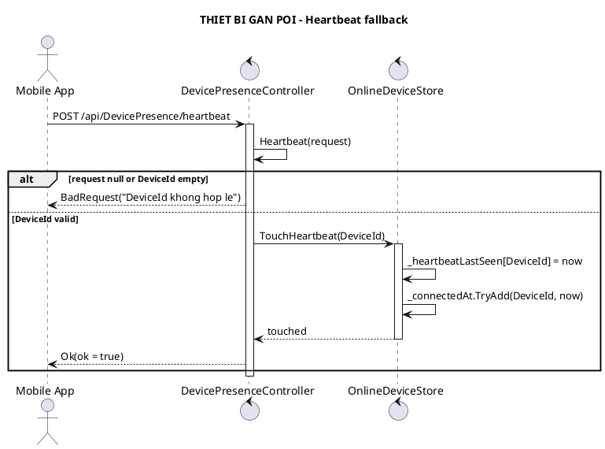
```plantuml
@startuml
title THIET BI GAN POI - Heartbeat fallback

actor "Mobile App" as MobileApp
control "DevicePresenceController" as DevicePresenceController
control "OnlineDeviceStore" as OnlineDeviceStore

MobileApp -> DevicePresenceController: POST /api/DevicePresence/heartbeat
activate DevicePresenceController
DevicePresenceController -> DevicePresenceController: Heartbeat(request)

alt request null or DeviceId empty
    DevicePresenceController --> MobileApp: BadRequest("DeviceId khong hop le")
else DeviceId valid
    DevicePresenceController -> OnlineDeviceStore: TouchHeartbeat(DeviceId)
    activate OnlineDeviceStore
    OnlineDeviceStore -> OnlineDeviceStore: _heartbeatLastSeen[DeviceId] = now
    OnlineDeviceStore -> OnlineDeviceStore: _connectedAt.TryAdd(DeviceId, now)
    OnlineDeviceStore --> DevicePresenceController: touched
    deactivate OnlineDeviceStore
    DevicePresenceController --> MobileApp: Ok(ok = true)
end

deactivate DevicePresenceController

@enduml
```

### 15.3.7 Dashboard lay thiet bi online gan POI

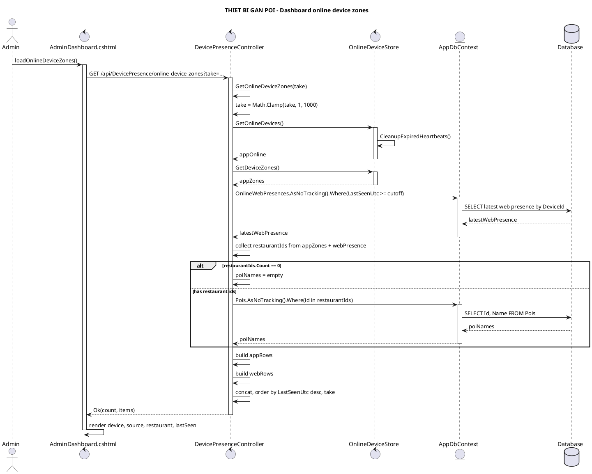
```plantuml
@startuml
title THIET BI GAN POI - Dashboard online device zones

actor Admin
control "AdminDashboard.cshtml" as Dashboard
control "DevicePresenceController" as DevicePresenceController
control "OnlineDeviceStore" as OnlineDeviceStore
entity "AppDbContext" as DbContext
database "Database" as Database

Admin -> Dashboard: loadOnlineDeviceZones()
activate Dashboard
Dashboard -> DevicePresenceController: GET /api/DevicePresence/online-device-zones?take=...
activate DevicePresenceController
DevicePresenceController -> DevicePresenceController: GetOnlineDeviceZones(take)
DevicePresenceController -> DevicePresenceController: take = Math.Clamp(take, 1, 1000)

DevicePresenceController -> OnlineDeviceStore: GetOnlineDevices()
activate OnlineDeviceStore
OnlineDeviceStore -> OnlineDeviceStore: CleanupExpiredHeartbeats()
OnlineDeviceStore --> DevicePresenceController: appOnline
deactivate OnlineDeviceStore

DevicePresenceController -> OnlineDeviceStore: GetDeviceZones()
activate OnlineDeviceStore
OnlineDeviceStore --> DevicePresenceController: appZones
deactivate OnlineDeviceStore

DevicePresenceController -> DbContext: OnlineWebPresences.AsNoTracking().Where(LastSeenUtc >= cutoff)
activate DbContext
DbContext -> Database: SELECT latest web presence by DeviceId
Database --> DbContext: latestWebPresence
DbContext --> DevicePresenceController: latestWebPresence
deactivate DbContext

DevicePresenceController -> DevicePresenceController: collect restaurantIds from appZones + webPresence

alt restaurantIds.Count == 0
    DevicePresenceController -> DevicePresenceController: poiNames = empty
else has restaurant ids
    DevicePresenceController -> DbContext: Pois.AsNoTracking().Where(id in restaurantIds)
    activate DbContext
    DbContext -> Database: SELECT Id, Name FROM Pois
    Database --> DbContext: poiNames
    DbContext --> DevicePresenceController: poiNames
    deactivate DbContext
end

DevicePresenceController -> DevicePresenceController: build appRows
DevicePresenceController -> DevicePresenceController: build webRows
DevicePresenceController -> DevicePresenceController: concat, order by LastSeenUtc desc, take
DevicePresenceController --> Dashboard: Ok(count, items)
deactivate DevicePresenceController

Dashboard -> Dashboard: render device, source, restaurant, lastSeen
deactivate Dashboard

@enduml
```

### 15.3.8 Sequence tong quat thiet bi gan POI

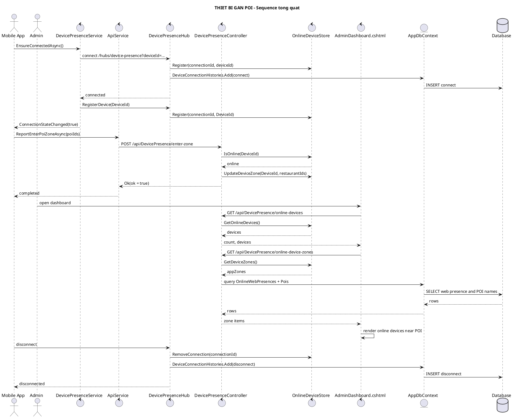
```plantuml
@startuml
title THIET BI GAN POI - Sequence tong quat

actor "Mobile App" as MobileApp
actor Admin
control "DevicePresenceService" as DevicePresenceService
control "ApiService" as ApiService
control "DevicePresenceHub" as DevicePresenceHub
control "DevicePresenceController" as DevicePresenceController
control "OnlineDeviceStore" as OnlineDeviceStore
control "AdminDashboard.cshtml" as Dashboard
entity "AppDbContext" as DbContext
database "Database" as Database

MobileApp -> DevicePresenceService: EnsureConnectedAsync()
DevicePresenceService -> DevicePresenceHub: connect /hubs/device-presence?deviceId=...
DevicePresenceHub -> OnlineDeviceStore: Register(connectionId, deviceId)
DevicePresenceHub -> DbContext: DeviceConnectionHistories.Add(connect)
DbContext -> Database: INSERT connect
DevicePresenceHub --> DevicePresenceService: connected
DevicePresenceService -> DevicePresenceHub: RegisterDevice(DeviceId)
DevicePresenceHub -> OnlineDeviceStore: Register(connectionId, DeviceId)
DevicePresenceService --> MobileApp: ConnectionStateChanged(true)

MobileApp -> ApiService: ReportEnterPoiZoneAsync(poiIds)
ApiService -> DevicePresenceController: POST /api/DevicePresence/enter-zone
DevicePresenceController -> OnlineDeviceStore: IsOnline(DeviceId)
OnlineDeviceStore --> DevicePresenceController: online
DevicePresenceController -> OnlineDeviceStore: UpdateDeviceZone(DeviceId, restaurantIds)
DevicePresenceController --> ApiService: Ok(ok = true)
ApiService --> MobileApp: completed

Admin -> Dashboard: open dashboard
Dashboard -> DevicePresenceController: GET /api/DevicePresence/online-devices
DevicePresenceController -> OnlineDeviceStore: GetOnlineDevices()
OnlineDeviceStore --> DevicePresenceController: devices
DevicePresenceController --> Dashboard: count, devices

Dashboard -> DevicePresenceController: GET /api/DevicePresence/online-device-zones
DevicePresenceController -> OnlineDeviceStore: GetDeviceZones()
OnlineDeviceStore --> DevicePresenceController: appZones
DevicePresenceController -> DbContext: query OnlineWebPresences + Pois
DbContext -> Database: SELECT web presence and POI names
Database --> DbContext: rows
DbContext --> DevicePresenceController: rows
DevicePresenceController --> Dashboard: zone items
Dashboard -> Dashboard: render online devices near POI

MobileApp -> DevicePresenceHub: disconnect
DevicePresenceHub -> OnlineDeviceStore: RemoveConnection(connectionId)
DevicePresenceHub -> DbContext: DeviceConnectionHistories.Add(disconnect)
DbContext -> Database: INSERT disconnect
DevicePresenceHub --> MobileApp: disconnected

@enduml
```

